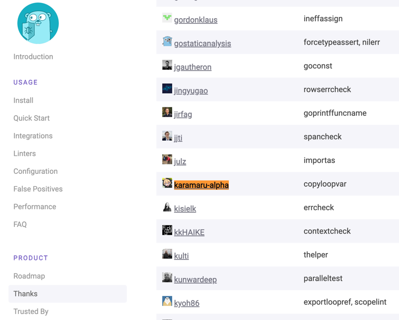

2024/06/30までに自分がやりたいことをまとめてみました。

<!--more-->

完了したものには✅マークをつけています。

## どっかに登壇する！

普段はゲームのバックエンドエンジニアとして頑張っていますが、やっぱり外部登壇してる人はかっこいいし憧れますよね！！

小さいLT会とかでもいいから、知識をまとめてどっかに登壇したいなー！！

現状何も知識ないからまずは勉強なんですけどorz

## OSSへ貢献する！ ✅

golangci-lintに自作linterをcontributeしました！🎉

cf. https://karamaru-alpha.com/posts/golangci-lint-contribute

## ボカロ曲を作る！

以下でボカロの入門はしてみたものの、ちゃんとイントロからサビまでフルでボカロ曲を作ってみたことはないので、今年こそは作ってみたい！！

cf. https://karamaru-alpha.com/posts/init-vocaloid

## 北海道で友達を作る！

先月雪ミクに行くために札幌・小樽に訪問したのですが、綺麗で閑静な街に一目惚れしてしました。

食べ物美味しいし、空気は綺麗だし、あとなんか北海道生まれっていいじゃないですか。

だから近々でまた北海道(できれば函館とか)に行って友達を作れたらいいなー！

## ボカロDJイベントにいっぱい行く！

今年の1,2月から[VOCALROCK MANIA](https://www.vocalockmania.com/)や[Digital STARS](https://digitalstars.club/)などボカロDJイベントに参加するようになりましたが、知らないボカロ曲が知れたり、ファンの熱量を実感できたりでハマっています。
もっと行きたいです！

