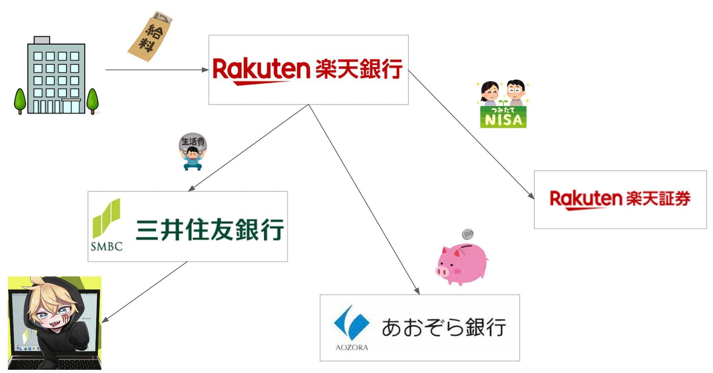

新社会人になって8ヶ月経ちました。からまるです。

最近、意図せず口座からお金がなくなっていっています。「貯金とは毎月のお賃金×経過月数」というのは幻で、学生に比べ多くの給料を貰え行動範囲がぐっと広がる新社会人が素直にお金を貯められる訳がありませんでした。

<!--more-->

かっこいいガジェットとか、可愛いメイド喫茶とか、推しのグッズとか、、、私欲に完全敗北です。よわよわです。ざーこ♡ってやつです。

コード品質を担保するためにCIを回すのと同様に、貯金も自動化しないとまずい。そう思い「僕が考えた最強の貯金の作り方」を一度考えてみることにしました。


### 口座の使い分けについて

貯金をシステム化するに当たって、給料を貯金・投資に天引きする仕組みを採用する必要があります。

一般的に「普段使い用口座」と「貯金用口座」と「投資用口座」を使い分けるのが良いようです。

それぞれ用途の口座について、以下の銀行を選択しました。

**普段使い用口座: 三井住友銀行**
- 要件
  - 現金引き出し・クレジットカードやPayPayの引き落としをここから行う
  - 機動性が必要(引き出し手数料)
  - 各地に店舗がある
- 採用理由
  - 現在使用しているので引き続き
  - 引き出し手数料も店舗数も問題なし

**貯金用口座: あおぞら銀行**

- 要件
  - 動かさないお金を配置する。
  - 金利が高いことが優先される。
  - 機動性はそこまでいらない。
- 採用理由
  - 普通預金の金利0.2%は唯一の存在らしい

**投資用口座: 楽天銀行**

- 要件
  - 積立NISAの証券に対応するもの
- 採用理由
  - 2023年は楽天経済圏を選択したので。
  - 2024年からはSBI経済圏乗り換えも検討したいが、一旦は初心者なので歴史のある方に。


### 給与振り込み口座について

給与振り込み口座には**楽天銀行**を採用します。理由は振り込み手数料の無料回数です。

楽天銀行は[ハッピープログラム](https://www.rakuten-bank.co.jp/happyprogram/)を使用することで月3回まで他行への振込を無料で行うことが出来ます。

3口座の本構成だと、毎月給与振り込み口座から他2口座への振込が発生するので、上記無料回数で足ります。


### 積立NISAについて

証券には楽天を選択したので、[eMAXIS Slim 全世界株式(オール・カントリー)](https://emaxis.jp/fund/253425.html)に毎月3.3万円積立しようと思います。

2024年から新NISAが開始されたら、余裕をみて毎月5万円~に積立額を修正する予定で、NISA以外の投資活動をすることは現状考えていません。

### 貯蓄割合について

まだ実家暮らしということもあって、収入の半分は貯蓄に回せそうです。

なので、収入をNとした場合は以下の配分になりますね。

```
貯蓄: N/2
投資: 3.3万円
普段使い: N/2-3.3万円
```

普段使いへの割り当てが多いのは許してほしいところです。。🥺
今年は一人暮らしを始めようと考えているので、そしたら貯蓄や普段使いの分から差し引きを行う予定です。


## まとめ

図解すると以下！！！！





めっちゃ賢い選択とかはわからないですが、現在の浪費が軽減されることは間違い無いでしょう。

来年はいっぱいお金溜まってるといいなー🍼
