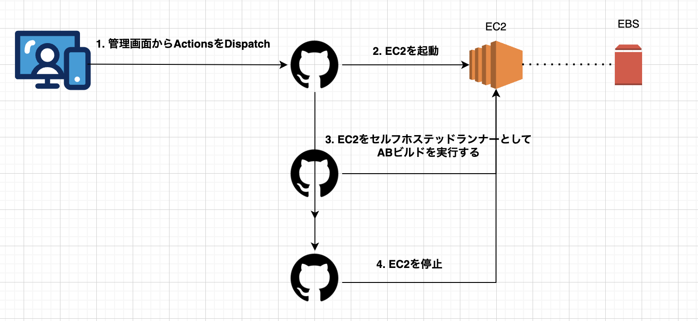
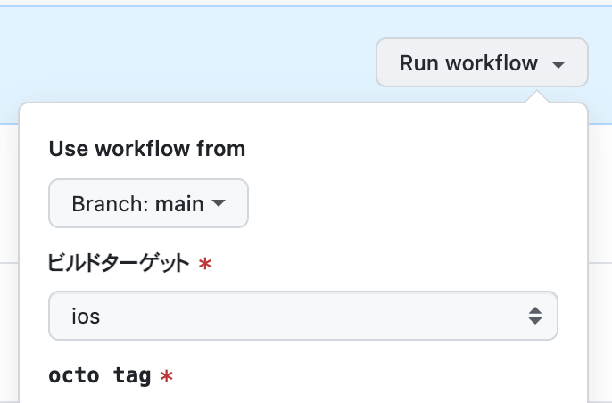
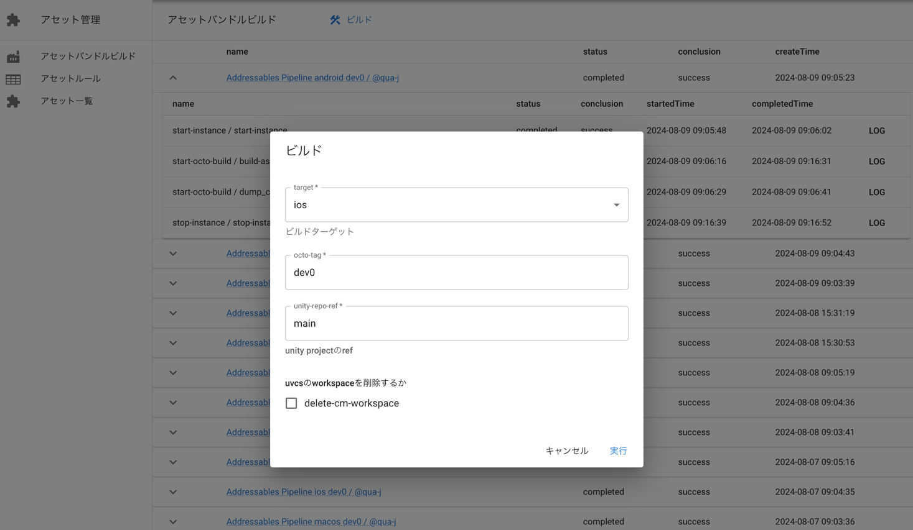

ゲーム業界で伝統的に使われているABビルド*Jenkins構成を使わないために頑張っている話

<!--more-->

## 先に結論

- Jenkins*MacProからGithubActions*EC2にしたよ

## 従来の構成(Jenkins*MacPro)

### Jenkinsを使っていた背景

弊プロジェクトでは従来までJenkins*MacProという構成でアセットバンドルビルドを含む多くのタスクを実行していました。
ECSなどにJenkinsControllerとしてWebUIを、物理PCにJenkinsAgentを入れてタスクランナーとして使う感じですね。

ゲーム業界でJenkinsが使用されている理由は[こちらのブログ](https://hikyaru-suzuki.hatenablog.jp/entry/2022/12/19/140000)が全て語ってくれています。
まとめると以下です。
- **前回の実行環境を引き継いで実行したい**
    - キャッシュを使いたいがその量が(特にアセット関係は)膨大でactions/cacheの上限(10GB)を超えてしまう
- **エンジニア以外でも実行できる/見やすいUIを用意したい**
    - 非エンジニアが実行する機会が多いため、githubアカウントを持っていない人でも実行できる環境と見た目が欲しい
- 従量課金でないこと

そしてJenkins*MacPro構成のデメリットは以下です。

- Jenkins自体のメンテナンスコストが高い。pluginのアップデートなど
- GitHub上でタスク定義を管理できない
- 物理PCをメンテナンスし続けるのが大変
- タスクランナーのマシンスペックが固定される

さて、今回は上記のようなデメリットを解消するため、ゲーム業界で伝統的に使われているJenkinsを全てActionsに移行するまで頑張ってみようという話です。

## 新しい構成(GithubActions*EC2)

### 方針

アセットバンドルビルドは依存が多くキャッシュの量も膨大なので、例えばGithubHostedRunnerのように実行環境が毎回クリーンな環境は適していません。

そこで、EC2をGithubActionsのセルフホステッドランナーとして登録させそれを起動・停止させる方法をとることにしました。
特定のVMをセルフホステットランナーにする方法は[公式から案内](https://docs.github.com/ja/actions/hosting-your-own-runners/managing-self-hosted-runners/configuring-the-self-hosted-runner-application-as-a-service)があります。
systemdのserviceとして登録することで、VM起動時にrunnerとして認識してくれるようになります。便利ですね。

本当であれば安価なスポットインスタンスを使用したいところでしたが、市場にリソースが余ってないと起動できないことや、インスタンスサイズを動的に変更できないなどのデメリットから見送り(オンデマンドVM)となりました。

この構成にすることのメリットは以下です

- 前回の実行環境を引き継いでCI実行できる(ルートボリュームであるEBSを引き回せるためファイル状態はそのまま引き継げる)
- インスタンスタイプを動的に変更することでマシンパワーを必要な時に必要な分だけ取得できる
- タスクの実行をyaml(GitOps)で管理できる
- sshやRDP接続を許可することで物理マシンに遜色ないランナーへのデバッグを行うことができる

さて、GithubアカウントがあればActions画面からDispatch可能です。

一方で、全ての実行者がGithubアカウントを持っていないケースも存在すると思います。弊プロジェクトもその例にもれなかった、UIは別途自作する必要がありました。
SlackAppか管理画面に統合するかで迷ったのですが、視認性や取り回しやすさから今回は管理画面に統合することにしました。ここの選択は好みだと思います。

GithubWorkflowIDを渡せばUIができるようにComponent化 && アカウントがなくてもLogやArtifact(成果物)を一定閲覧できるようにしました。

## 終わりに

以上がアセットバンドルビルドにおける脱Jenkinsを頑張っている話でした。 他にもいい案があれば募集中です！

他にもUnityAcceleratorを建てた話とかも書きたいなあ
