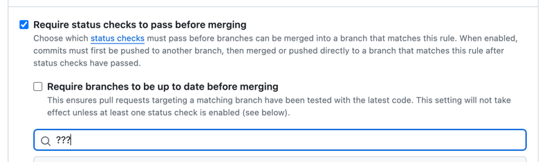
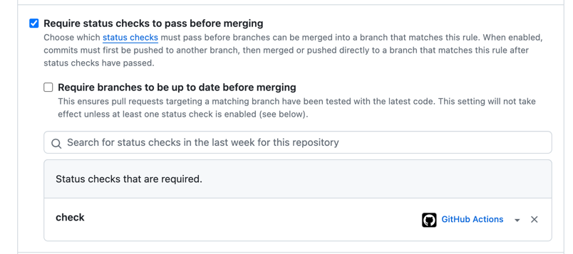

Githubの仕様に戸惑ったので備忘録的に書きます。

<!--more-->


## 先に結論

1. dependabotでpatchバージョンは自動マージしたい
2. 有効なCI全てのpassをmerge条件にしたい


## 1. dependabotでpatchバージョンは自動マージする


[セマンティックバージョニング](https://semver.org/lang/ja/)によると、patchバージョンのリリースは後方互換を保つ軽微なバグ修正などで行われるべきとされています。

dependabotのPRを目視するのは新機能が追加された時(minor)や後方互換性が保たれなくなった時(major)のみにしたいと思ったので、dependabotが上げるPRの最大差分がpatchバージョンならAutoMergeさせるようにしました。

手順は公式が用意してくれているのでスーパーイージーですね。

cf.https://docs.github.com/ja/code-security/dependabot/working-with-dependabot/automating-dependabot-with-github-actions#common-dependabot-automations

```yaml
name: Dependabot auto-merge
on: pull_request

permissions:
  contents: write
  pull-requests: write

jobs:
  dependabot:
    runs-on: ubuntu-latest
    if: github.actor == 'dependabot[bot]'
    steps:
      - name: Dependabot metadata
        id: metadata
        uses: dependabot/fetch-metadata@v2
        with:
          github-token: "${{ secrets.GITHUB_TOKEN }}"
      - name: Enable auto-merge for Dependabot PRs
        if: contains(steps.metadata.outputs.dependency-names, 'my-dependency') && steps.metadata.outputs.update-type == 'version-update:semver-patch'
        run: gh pr merge --auto --merge "$PR_URL"
        env:
          PR_URL: ${{github.event.pull_request.html_url}}
          GH_TOKEN: ${{secrets.GITHUB_TOKEN}}
```


## 2. 有効なCI全てのpassをmerge条件にする

全てのライブラリがセマンティックバージョニングを採用しているわけではないため、このままCIを通さずにmergeさせるのは避けたいところですね。 ちなみに、`gh pr merge --auto`はマージ条件を満たしたらmergeするよ！というコマンドで、これを利用していきたいわけです。

さて、CIをmerge条件にするにはブランチプロテクションの以下「???」のところにJob名を指定する必要があります。




ここで問題となってくるのが、ステータスチェックの挙動です。例えばGoとJsのモノレポがあったとして、それぞれlinterを走らせるworkflow/jobがあるとします。 そして、以下`go-lint`と`ja-lint`をマージ要件として設定します。

Q. この状態でGoのライブラリpatchアップデートを行うdependabotのPRが生まれた時、そのPRは自動でマージされるでしょうか？

```yaml
# .github/workflows/pull-request-for-go.yml
name: Pull Request for Go

on:
  pull_request:
    paths:
      - '**.go'
      - go.mod
      - go.sum
      - .github/workflows/pull-request-for-go.yml

jobs:
  lint:
    name: go-lint
```

```yaml
# .github/workflows/pull-request-for-js.yml
name: Pull Request for JS

on:
  pull_request:
    paths:
      - 'web/**'
      - .github/workflows/pull-request-for-js.yml

jobs:
  lint:
    name: js-lint
```

答えはNoで、マージ要件が満たされずに自動マージが無効になります。

ドキュメントをみてみると、 workflowの**path/branchフィルターで実行されなかったJobについてはステータスチェックがpassされない**ということが明記されています。(一方Jobの条件分岐でskipされた場合はpassする)

> If a workflow is skipped due to path filtering, branch filtering or a commit message, then checks associated with that workflow will remain in a "Pending" state. A pull request that requires those checks to be successful will be blocked from merging. If, however, a job within a workflow is skipped due to a conditional, it will report its status as "Success". For more information, see "Using conditions to control job execution."

cf. https://docs.github.com/en/pull-requests/collaborating-with-pull-requests/collaborating-on-repositories-with-code-quality-features/troubleshooting-required-status-checks#handling-skipped-but-required-checks

つまり、Goのライブラリアップデートがあった上記例では、`js-lint`がpathフィルターで実行されずステータスチェックをpassできなくなっており、merge制約に引っかかってしまっていたんですね。

さて、必要十分なCIの成功を待ってdependabotのPRをAutoMergeさせるのにはどんな方法があるでしょうか？ いくつかの(というか考えられる全ての)方法は、偉大な先人が以下に記してくれていました。

cf. [モノレポで不要なGithub Actions実行を最小にしつつマージブロック機能(マージ前必須チェックステータス)を使う方法の検討](https://zenn.dev/bigwheel/articles/05accc6323de18)

記事に倣い、私も**Job名統一法**を選択しました。APIのポーリングとかはVM代もかかりますしね。

`Require status checks to pass before merging`でCIを設定したい場合Job名を指定します。
複数マッチした場合は全て成功である必要があり、1つもマッチしない場合は落ちます。


よって、マージ制約として設けたいJobの名前を統一しつつ、全てのワークフローが走らなかった場合でもマージできるように必ず成功するワークフローをダミーでおくことで、必要十分なCIのpassをマージ条件にすることができます。




```yaml
# .github/workflows/pull-request-for-go.yml
name: Pull Request for Go

on:
  pull_request:
    paths:
      - '**.go'
      - go.mod
      - go.sum
      - .github/workflows/pull-request-for-go.yml

jobs:
  lint:
    name: check # "check"で命名統一
```

```yaml
# .github/workflows/pull-request-for-js.yml
name: Pull Request for JS

on:
  pull_request:
    paths:
      - 'web/**'
      - .github/workflows/pull-request-for-js.yml

jobs:
  lint:
    name: check # "check"で命名統一
```

```yaml
# .github/workflows/nop.yml
# NOTE: 常にJobスキップするWorkflow
# Githubにおけるmerge制約でCI(Job)を指定した場合、名前でマッチした全てのJobが成功した時のみステータスチェックが通る。1つもマッチしない場合は落ちる。
# merge制約に設けたいJob名を"check"で統一し、それら全てがスキップされた場合もmergeできるように常にJobスキップ(成功)するWorkflowを用意する。
# cf.https://docs.github.com/en/enterprise-server@3.7/pull-requests/collaborating-with-pull-requests/collaborating-on-repositories-with-code-quality-features/troubleshooting-required-status-checks
name: NOP

on:
  pull_request:

jobs:
  nop:
    name: check
    runs-on: ubuntu-latest
    if: false
    steps:
      - run: exit 0
```

わーい！これで必要十分なCIの完了を待ちつつ、dependabotのAutoMergeを実現することができましたね！
