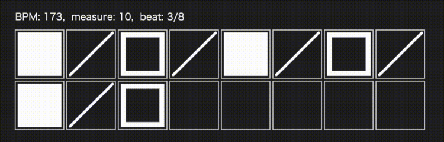
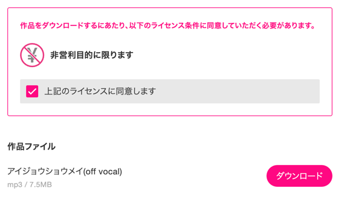
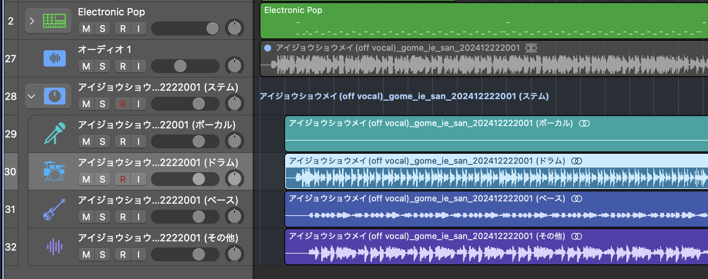

MIDIファイルから読み込んだドラムパターンをビジュアライズしました。

<!--more-->

[QualiArts Advent Calender 2024](https://qiita.com/advent-calendar/2024/qualiarts)の23日目担当です！

## 先に結論

こんな感じ！
MIDIファイルからドラムやキック、シンバルの音を判別して、いい感じに表示してくれるんだ！





カラム数も調整できるから、8×2とかもいけちゃう！
かわいい！MVのパーツっぽくて素敵！

## 使用技術とソース

- [p5.js](https://github.com/processing/p5.js)
  - 描画周りをめちゃラップしてくれてるやつ
- [tonejs/midi](https://github.com/Tonejs/Midi)
  - 音を出したりMIDIファイルを読み込んだりしてくれるやつ
- [typescript](https://www.typescriptlang.org/)
- [parcel](https://parceljs.org/)

https://github.com/karamaru-alpha/canvas

## 作った経緯

今年のアドカレはRustでvimを作るぞーーって思ってたんです。 海外に[既にチュートリアル](https://www.flenker.blog/hecto/)があって、これを参考に作る感じで。

けどviewerまで作った段階で、結構写経だけだからアドカレとしては退屈かもな〜思って、担当日前日で題材変更を決意しました。
(この資料自体は素晴らしいんですけどね！）

残骸↓
https://github.com/karamaru-alpha/rim

じゃあ何を作ろうかな〜って考えてたら、最近自分が好きな新進気鋭[ボカロP新目鳥さんのMusicVideo](https://x.com/Symmez/status/1837145735399363032/video/1)がめっちゃカッコよかったことを思い出して、これを作りたい！って思いました。
p5.jsを使用しているって情報はあった(というかその情報しかないけど)ので、頑張って作ろうと思いました。

動画にはピアノの音程とかいっぱい入っててすごいけど、 とりあえず今回はドラムのビジュアライザー作りました！

## 仕組みと流れ

LogicProで作成したドラムトラックをMIDIファイルに書き出し、tone.jsで読み込んでビジュアライズしました。

### 1. 非営利目的で利用可能な音源を探す

今回は自分が好きな[ごめんなさいが言えなくてさんのアイジョウショウメイ](https://piapro.jp/t/tms7)をお借りしました。

### 2. Logic Pro に読み込み -> ドラムパターンを打ち込み

本プログラムではドラム専用のトラックに打ち込みが必要です。 piaproからのダウンロードはmp3(オーディオ波形の)形式で落ちてくるので、このまま使用することはできないんですね。

最終おててで入力するしかないのですが、耳コピしやすいようにLogic Proのstem Splitterでドラムのみの音源を抽出後、それに合う形で打ち込みを行いました。

正直今回はバスドラム・スネア・シンバルの場所さえ大体打ち込めていればいいのでそんなにする必要もないのですが、雰囲気が大事ってことでmm

### 3. MIDIファイルに書き出し -> tone.jsでJSON/ts型に変換

先ほど手書きしたドラムのトラックをMIDIファイルで書き出し、 tone.jsを用いて読み込みます。

tone.jsで読み込んだ後に参照できる値は[こちら](https://github.com/Tonejs/Midi?tab=readme-ov-file#format)をご覧ください。

`notes`が音の配列で、各`tone`に音の登録番号`midi`や始点`ticks`などを取得することができます。

### 4. p5.jsで描画

あとはいい感じにp5.jsでアニメーションしながら、ドラムの音に合わせて描画するだけです。
シンバル>スネア>バスドラムの順で、拍子の中にある音色に応じて模様を変更するようにしています。

- シンバル: 四角くるくる
- スネア: くりぬき四角
- バスドラ: 四角
- その他: 斜線

https://github.com/karamaru-alpha/canvas/blob/main/README.md

## 感想

毎フレーム描画されるみたいなやつに触れたことがなかったのでシンプルにおもちゃとして楽しかった！
拍子の計算とかは結構難しかった(し多分リズムも少しずれてる)ので、もう少しいい感じにできたらよかったかな><
けど1日で作ったものとしては満足！好奇心が満たされました！👏
