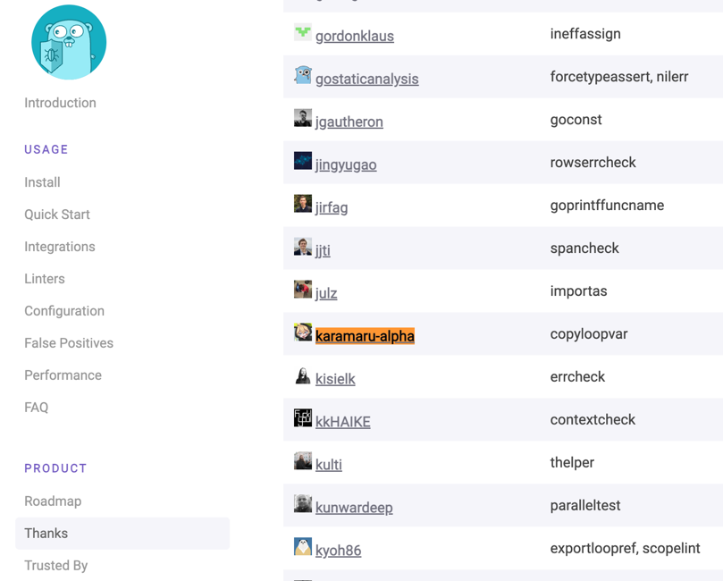

golangci-lintに以下自作linterを導入させましたーー！嬉しい！！🎉

<!--more-->

https://github.com/karamaru-alpha/copyloopvar

### どんなlinter？

1.22から不要になったループ変数のコピーを警告するLinterを作成しました。(厳密には1.21で`GOEXPERIMENT=loopvar`を指定する時も不要になる)

cf. [Fixing For Loops in Go 1.22](https://go.dev/blog/loopvar-preview)

具体的な静的解析の作り方を知りたい人は、以下優秀な同期の記事が参考になると思います。

cf. [golangci-lintに新しいlinterを追加する方法](https://zenn.dev/sivchari/articles/05545de4a04b40)

### 感想

全然大したことしてないけど、 README.mdと公式サイトに乗れたの嬉しすぎました！！！！！

https://golangci-lint.run/product/thanks/

https://github.com/golangci/golangci-lint/blob/master/README.md

