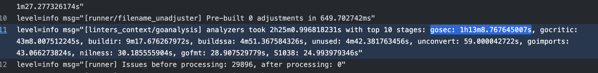
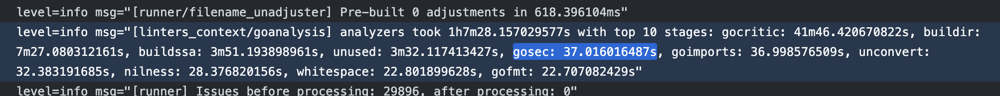
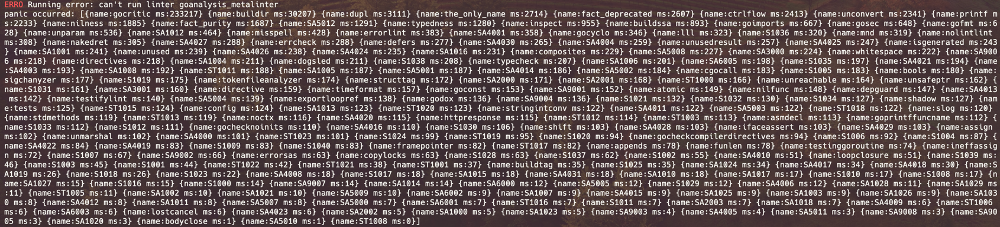

この方法を使って30mのCIを5mにしました。

<!--more-->

## 先に結論

1. verboseオプションで実行時間Top10のstage一覧をみる
2. コード改変して有効な全てのlinterの実行時間を計測する

## 1. verboseオプションで実行時間Top10のstage一覧をみる

有名な方法ですね。 パフォーマンス起因の調査の場合、多くのケースでこの方法で事足りる気がします。

実行時`--verbose`もしくは`-v`をつけることでより詳細な実行結果が閲覧できます。
```sh
golangci-lint run --verbose
```
cf. https://golangci-lint.run/usage/configuration/#command-line-options

この出力結果の中に、実行時間がかかっているstageのTop10が出るということですね。
以下画像だと[gosec](https://github.com/securego/gosec)が最も重いLinterですね。次点で[gocritic](https://github.com/go-critic/go-critic)。

CI自体の時間は30mですが、golangci-lintは並行実行に対応しているので時間が大きく出ていますね。




ここまで分かればあとは対象のlinterのうちどのルールが遅いのかを調べて改善するだけですね。

今回の例だと運良くgosecのG602が遅いということが見つけられたので、これをignoreすることでCIの時間を30mから5mまで短縮することができました。(すごい！)
```yaml
linters-settings:
  gosec:
    excludes:
      - G602
```
cf. https://github.com/golangci/golangci-lint/issues/4039
cf. https://github.com/securego/gosec/issues/1007



gosecのパフォーマンスの話は結構前のものなのでもう治ってるかもですね。
けど、遅いlinterを特定する手順自体は参考になるんじゃないんでしょうか。


## 2. コード改変して有効な全てのlinterの実行時間を計測する

さて、ここからは物好きな人向けですね。

verboseオプションをつけて実行した時に実行時間Top10が出てくる仕組みはどこにあるんでしょうか？

答えは[pkg/goanalysis/runners.go](https://github.com/golangci/golangci-lint/blob/a9ea7d32dc8eb641d67d720f9a5415247ab3bc1b/pkg/goanalysis/runners.go#L36)あたりで、固定値10を引数に実行時間の出力を予約してそうなコードが見つかります。
```go
const stagesToPrint = 10
defer sw.PrintTopStages(stagesToPrint)
```

そして実際にstageを実行時間順にsortした後出力するのは[pkg/timeutils/stopwatch.go](https://github.com/golangci/golangci-lint/blob/a9ea7d32dc8eb641d67d720f9a5415247ab3bc1b/pkg/timeutils/stopwatch.go)です。
引数のnが`stagesToPrint=10`ですね。
```go
func (s *Stopwatch) sprintTopStages(n int) string {}
    if len(s.stages) == 0 {
        return noStagesText
    }
    stageDurations := s.stageDurationsSorted()
    var stagesStrings []string
    for i := 0; i < len(stageDurations) && i < n; i++ {
        s := stageDurations[i]
        stagesStrings = append(stagesStrings, fmt.Sprintf("%s: %s", s.name, s.d))
    }

    return fmt.Sprintf("top %d stages: %s", n, strings.Join(stagesStrings, ", "))
}
```

そうなんです、ここまでくればもうおわかりですね。

golangci-lintのコードを落としてきて以下のようにコードを変更した後、`make build`をすれば全ての有効なstageの実行時間を出力させるgolangci-lintバイナリを作ることができるんです👏
```go
func (s *Stopwatch) sprintTopStages(n int) string {
	if len(s.stages) == 0 {
		return noStagesText
	}
	stageDurations := s.stageDurationsSorted()
	// ==================== 以下デバッグ
	type stageDurationDetail struct {
		name string
		ms   int
	}
	details := make([]stageDurationDetail, 0, len(stageDurations))
	for _, v := range stageDurations {
		details = append(details, stageDurationDetail{
			name: v.name,
			ms:   int(v.d.Milliseconds()),
		})
	}
	panic(fmt.Sprintf("%+v", details))
	// ==================== デバッグおしまい
	var stagesStrings []string
	for i := 0; i < len(stageDurations) && i < n; i++ {
		s := stageDurations[i]
		stagesStrings = append(stagesStrings, fmt.Sprintf("%s: %s", s.name, s.d))
	}

	return fmt.Sprintf("top %d stages: %s", n, strings.Join(stagesStrings, ", "))
}
```

誰がここまで見たいねん！と思う気もしますが、気が迷った時に覗いてみてください🙆




## 終わりに

色々書きましたがgolangci-lintの基本は以下だと思っています。

- disable-allして必要なものだけenableする
- 適宜結果をキャッシュする(ローカルをdocker起動している場合はGOCACHE/GOLANGCI_LINT_CACHEの設定に注意)
  - https://github.com/pipe-cd/pipecd/pull/4628


[GOGCを調整したり](https://golangci-lint.run/product/performance/)並行数を変えたり細かいところを変える前に、ルールとキャッシュの見直しをお勧めします。

それでは、楽しいlintライフを！
