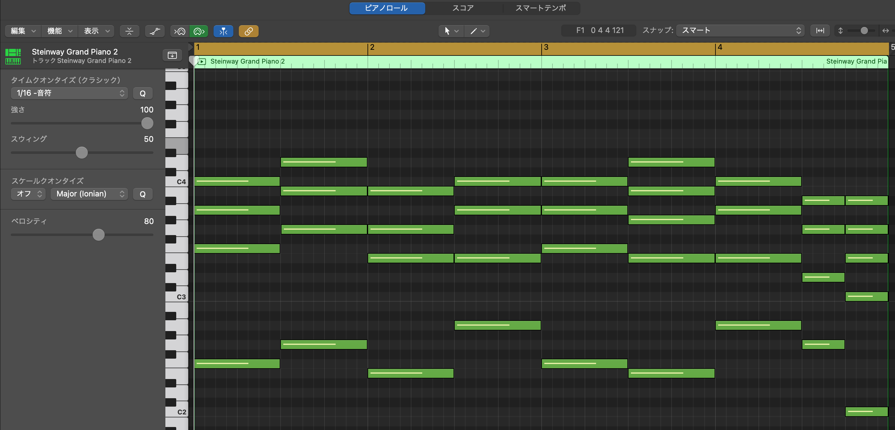
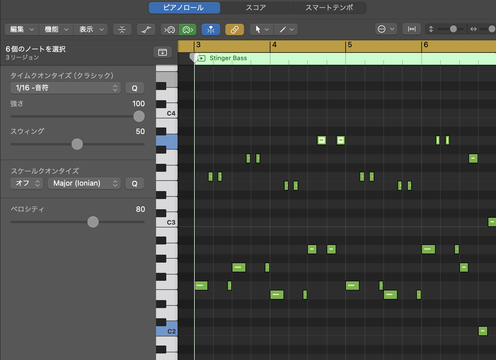
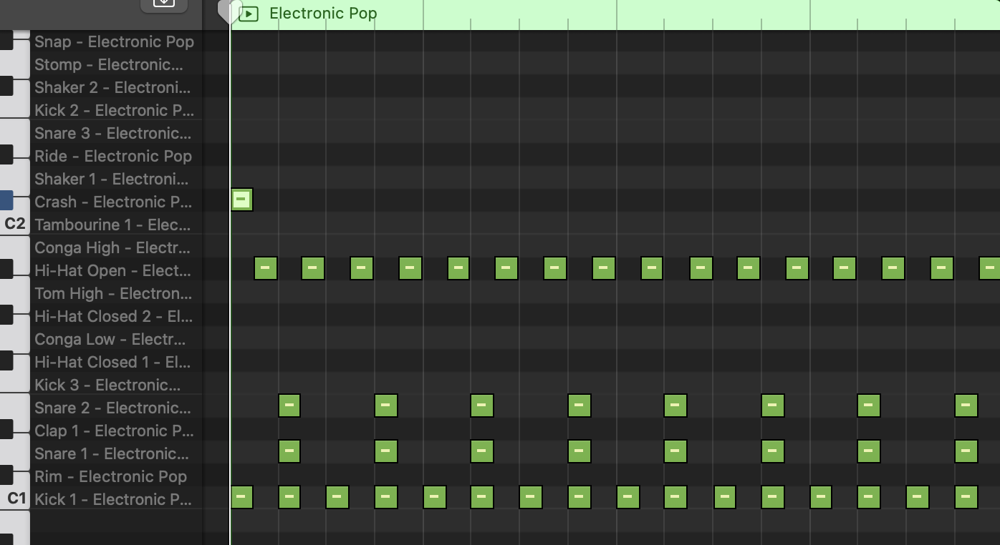
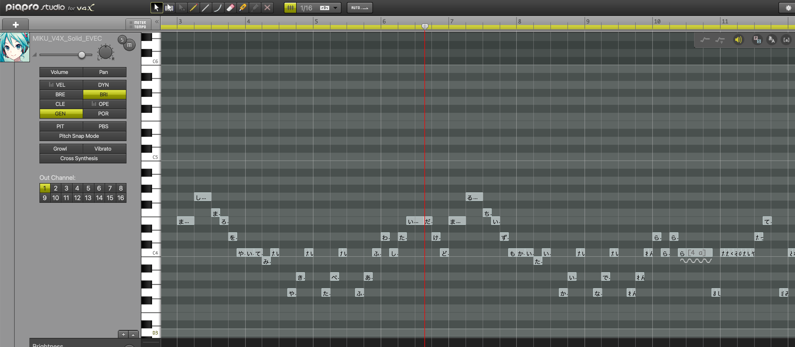
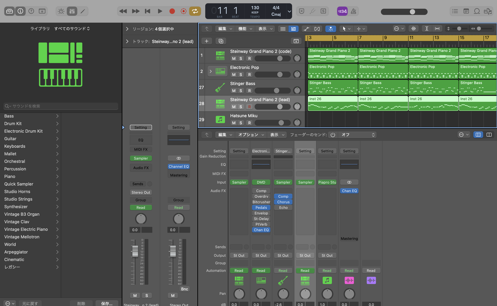

23歳のうちに夢をかなえるシリーズです！

前回の"VTuberになる"に続き、今回は"ボカロPになる"という夢に入門してみたいと思います！

<!--more-->

(VTuberになるブログはこちら: https://karamaru-alpha.com/posts/init-vtuber/)

## 成果物

4小節のボカロ曲ができました、マシュマロを焼いて食べてみたいソングです👏👏👏

コードベタ打ちで初心者感丸出しな感じがありますが、初めはこんなんでいいんです。やることが大事なんです！！！(自己暗示)



やっと初音ミクお迎えしました！パッケージかわいいい

[初音ミクNT](https://www.google.com/search?q=%E5%88%9D%E9%9F%B3%E3%83%9F%E3%82%AFNT&sca_esv=593850889&sxsrf=AM9HkKlE7MDOua4yOfL0t0b_VbegsdDzRg:1703631722889&ei=aluLZaz6NcbvseMP396byA8&ved=0ahUKEwis167dmq6DAxXGd2wGHV_vBvkQ4dUDCBA&uact=5&oq=%E5%88%9D%E9%9F%B3%E3%83%9F%E3%82%AFNT&gs_lp=Egxnd3Mtd2l6LXNlcnAaAhgCIg7liJ3pn7Pjg5_jgq9OVDIFEAAYgAQyBRAAGIAEMgUQABiABDIFEAAYgAQyBRAAGIAEMgUQABiABDIFEAAYgAQyBRAAGIAEMgUQABiABDIFEAAYgARIqwtQmgJYjQpwAXgBkAEAmAGSAaABwAWqAQMwLjW4AQPIAQD4AQHCAgoQABhHGNYEGLADwgIKECMYgAQYigUYJ8ICChAAGIAEGIoFGEPCAgQQIxgnwgIREAAYgAQYigUYsQMYgwEYiwPCAg4QABiABBixAxiDARiLA8ICDRAAGIAEGIoFGEMYiwPCAggQABiABBiLA8ICChAAGIAEGAQYsQPCAg0QABiABBgEGLEDGIMBwgIHEAAYgAQYBOIDBBgAIEGIBgGQBgo&sclient=gws-wiz-serp)という比較的新しいバージョンもあるのですが、細かい調教前提で比較的難しいとのことで今回は[初音ミクV4X](https://www.google.com/search?q=%E5%88%9D%E9%9F%B3%E3%83%9F%E3%82%AFv4x&sourceid=chrome&ie=UTF-8)を選択しました。

## 目次

1. 【座学】コード進行における音楽理論について大まかに学ぶ
2. 【実践】定番のコードについて学び、コード進行を作成し、4小説の曲を作る

## 1.【勉強】コード進行における音楽理論について大まかに学ぶ

作曲何もわからないので、まずは作曲の基礎であるコード進行の理論を学びます。
教材はおざしんミュージックさんのYoutubeプレイリスト「[誰でもわかるコード進行・音楽理論講座](https://www.youtube.com/playlist?list=PLeHRa-xAEiYRpSdsxpdmr9SQqEw5jw-jX)」の基本編1~15回にしたいと思います。

とてもわかりやすく神教材でしたmm　備忘録として以下に要点メモ書きしています。

### 1~3回: 音名とスケール

#### 音名
- ドレミファソラシド: イタリア式音名
- ハニホヘトイロハ: 日本式
- CDEFGAB: 英・米式

#### 音程

- 音程: 音と音の距離を示す言葉
  - 1度: 同じ音
  - N度の音: 低い音+(N-1)音離れた音
    - 間に黒鍵が入る場合の2度は全音 (e.g. ド→レ)
    - 間に黒鍵が入らない場合の2度は半音 (e.g. ミ→ファ)
- ピッチ: 音の高さ

#### ドレミファソラシドのインターバル(隣り合った音程の関係)

- ド→レ: 全音 (レ♭の黒鍵が挟まる)
- レ→ミ: 全音 (ミ♭の黒鍵が挟まる)
- ミ→ファ: 半音
- ファ→ソ: 全音　(ソ♭の黒鍵が挟まる)
- ソ→ラ: 全音　(ラ♭の黒鍵が挟まる)
- ラ→シ: 全音　(シ♭の黒鍵が挟まる)
- シ→ド: 半音

#### スケールとは

- 特定の音から、"全・全・半・全・全・全・半"のような**インターバル**を使用して見つかる音を並べたものを**スケール**と呼ぶ
- "全・全・半・全・全・全・半"というインターバルのスケールを**メジャースケール**と呼ぶ
- ド(C)から始まるメジャースケールを**Cメジャースケール**(ハ長調)と呼ぶ (=ドレミファソラシド)

#### ナチュラルマイナースケール

- "全・半・全・全・半・全・全"というインターバルのスケールを**ナチュラルマイナースケール**と呼ぶ
- Cナチュラルマイナースケールは"ドレミ♭ファソラ♭シ♭ド"で構成され、メジャースケールの第3,6,7音が半音下がる
- 短調(ナチュラルマイナースケール)は悲しい雰囲気を出すのに適している

#### 並行調と同主調

- ナチュラルマイナースケール"全・半・全・全・半・全・全"の第三音からのインターバルは"全・全・半・全・全・全・半"となり、これはメジャースケールと等しい
- よって、メジャースケールを2つ前の音からスタートするとなちゅなるマイナースケールになる
  - Cメジャースケールを2つ前の音から弾いた"ラシドレミファソ"はAナチュラルマイナースケールになる
- このように元のメジャースケールと順番を変えて弾いたナチュラルマイナースケールとの関係を**並行調**と呼ぶ
- 逆に同じ音から始まっているメジャースケールとナチュラルマイナースケールの関係を**同主調**と呼ぶ

### 4~5回 コード理論入門

#### 3和音のダイアトニックコード

- 3度ずつ2つの音を重ねたコードを**ダイアトニックコード**と呼ぶ。 (ルート+3度+5度)

- Cメジャースケールなら...
  - C: ド(C)・ミ(E)・ソ(G)
  - Dm: レ(D)・ファ(F)・ラ(A)
  - Em: ミ(E)・ソ(G)・シ(B)
  - F: ファ(F)・ラ(A)・ド(C)
  - G: ソ(G)・シ(B)・レ(D)
  - Am: ラ(A)・ド(C)・ミ(E)
  - Bm(♭5): シ(B)・レ(D)・ファ(F)

#### メジャーコードとマイナーコードの違い

- メジャーコード: ルートと3度が4半音離れている
  - C・F・G
- マイナーコード: ルートと3度が3半音離れている
  - Dm・Em・Am・Bm(♭5)
    - 特殊な5度を持つコード
      - Bm(♭5): シ(B)・レ(D)・ファ(F)は、ルートと5度が6半音離れている(通常7半音)のため、(b5)という記号を後ろにつける

#### 4和音のダイアトニックコード

- 3度ずつ3つの音を重ねたコードで、3和音のダイアトニックコードに7度を追加したもの。

- Cメジャースケールなら...
  - C△7: ド(C)・ミ(E)・ソ(G)・シ(B)
  - Dm7: レ(D)・ファ(F)・ラ(A)・ド(C)
  - Em7: ミ(E)・ソ(G)・シ(B)・レ(D)
  - F△7: ファ(F)・ラ(A)・ド(C)・ミ(E)
  - G7: ソ(G)・シ(B)・レ(D)・ファ(F)
  - Am7: ラ(A)・ド(C)・ミ(E)・ソ(G)
  - Bm7(♭5): シ(B)・レ(D)・ファ(F)・ラ(A)

#### 7度の種類

- C△7・F△7: ルートから7度が11半音離れている。これを**メジャーセブンス**と呼ぶ
- Dm7・Em7・G7・Am7・Bm7(♭5): ルートから7度が10半音離れている。これを**セブンス**と呼ぶ

### 6~8回 コード進行と転回

- 複数のコードを順番にならべたものを**コード進行**という
- 最初のコードによって進行の印象が変わりやすい
- C・Amから始まる進行が2/3を占めていて、最近はF始まりが増えてきたらしい

#### コード進行のバリエーション

- C・Am・Dm・G: 1625進行
- C・G。Am・Em・F・C・Dm・G: カノン進行。キャッチー
- Am・F・G・C: 小室進行。かっこいい感じ
- F・G・Em・Am: J-POP進行
...

コードチェンジのタイミングによってもバリエーションをつけられる

#### 和音の転回

C・Am・F・Gをそのまま引くと、音程の乖離が大きくなって不自然になってしまう。
 
- 前後のコード同士で同じ音階がある場合はそのまま、それ以外の場合は前の音階の隣の音を使うと自然になる
- コードの重ね方を**ボイシング**という
- 音程の乖離を少なくするなどの目的で、ボイシングの順番を変えることを**転回**という。(Cコード"ド・ミ・ソ"を"ミ・ソ・ド"にするなど)
  - 本来のコードを基本形。最低音がルート (ド・ミ・ソ: C) (ベースも最低音とみなす)
  - 1回転回したものを 第1転回系 (ミ・ソ・ド: C/E) (ConE)
  - 2回転回したものを 第2転回系 (ソ・ド・ミ: C/G) (ConG)

- 転回系を使った進行のアレンジとして、 ベースラインの動きを小さくすることによって落ち着いた感じに、大きくすることでダイナミックに表現することができる
- わかりやすさ的に、C△7/BをC/Bと表記することもある

### 9~10回 コードの機能

#### 機能とケーデンス

お辞儀のコードC・G7・Cは、Cは安定、G7は不安定・緊張という機能がある。

- 安定的なコードは**トニック**と呼ばれる (e.g. Cコード)
- 緊張するコードは**ドミナント**と呼ばれる (e.g. G7コード)
  - 強い力でトニックに戻りたがる
- 半安定・半緊張なコードは**サブドミナント**と呼ばれる (e.g. Fコード)
  - 弱い力でトニックに戻りたがる
  - ドミナントにも行ける

トニックに着地するコードの動きの最小単位を**ケーデンス**(カデンツ・終始形)という。
- トニック->ドミナント->トニック
- トニック->サブドミナント->トニック
- (トニック)->サブドミナント->ドミナント->トニック

#### ダイアトニックコードの機能

- Cメジャースケールなら...
  - **C**: トニック
  - Dm: サブドミナント (Fと2音一緒)
  - Em: トニック (Cと2音一緒)
  - **F**: サブドミナント
  - **G**: ドミナント
  - Am: トニック (Cと2音一緒)
  - Bm(♭5): ドミナント (Gと2音一緒)

- C・F・Gを**主要3和音**といい、それぞれと同じ機能のコードを**代理コード**という。(e.g. AmはCの代理コード)
- 主要3和音と代理コードは大枠の流れを変えずに入れ替え可能 (お辞儀: C・G7・C -> C・G7・Am⭕️)
  - CメジャースケールにおけるトニックコードC・Em・Amについて、C・Amはスケールのルートであるドの音を含むが、Emは含まない。また、EmはドミナントのGとも2音共通であるため、トニックの中でもドミナントっぽい要素も持つ
  - よって、全ての代理コードが主要3和音と綺麗に差し替え可能とは限らない (お辞儀: C・G7・C -> C・G7・Em❌)

### 11~13回 応用編: ドミナント
ド・ミ・ソ
ドミナント->トニックはなぜ緊張と緩和をを生み出すのか

#### 強進行
- G(ドミナント)->C(トニック)のベース音は、ソ->ドと動いている。完全4度(=5半音)上または完全5度(=7半音)下に動く進行を**強進行**といい、強い終止感を生み出す。
- ドを強く弾くと、ソの音が聞こえる。この時、前者を**基音**、後者を**倍音**と呼ばれる。倍音が基音を想起させるため強進行が生まれたという説もある。
- 強進行は必ずしもドミナント->トニックであるとは限らない

#### トライトーン
- Cメジャースケールでは、Cに含まれるド・ミ・ソが最も安定しているとされる
- 一方、シ・ファはCに含まれる音と半音違いなので不安定に聞こえ、ド・ミ・ソに収束したがる　(導音と主音)
- また、鈍い響きを生む6半音離れた(減5度)の音の組み合わせを**トライトーン**といい、シ・ファもこの関係である。

Cメジャースケールでシ・ファ(トライトーン)を持つコードは...
- Bm(♭5): シ(B)・レ(D)・ファ(F)
- G7: ソ(G)・シ(B)・レ(D)・ファ(F)
- Bm7(♭5): シ(B)・レ(D)・ファ(F)・ラ(A)

#### ドミナントモーション

Cメジャースケールでトライトーンを持つコードの中でも、Cに戻りやすいのはG7である。
なぜなら、G7->Cのベースの動きはソ->ドで、強進行が起こり強い終止感を生み出すからである。

このように、**強進行ができる**且つ**トライトーンを持つ**○7の和音の形を**ドミナントセブンスコード**と呼び、対応する完全4度上(or完全5度下)のコードに移行することを**ドミナントモーション**(解決)という

#### マイナースケールでのドミナントモーション

Aナチュラルマイナースケールでは、Am・Dm・Emが主要3和音になり、コードの機能は以下になる。

- **Am**: トニック
- Bm(♭5): サブドミナント 
- C: トニック
- **Dm**: サブドミナント
- **Em**: ドミナント (Amに向かって強進行できる)
- F: トニック
- G: ドミナント

- Em7->Am7のドミナントモーションが成りたつかどうか -> 成り立ちづらい
  - Aナチュラルスケールの主音はラ(A)。 ラと半音違いの音がダイアトニックコード上に存在しない(ラの左右は黒鍵で挟まれている)ため、Em7->Am7のドミナントモーションは不安定->収束が成り立たない
  - また、Em7にはトライトーンが存在しない(ミ->シ・ソ->レ共に7半音。トライトーンは6半音離れた(減5度)の音の組み合わせ)

- ラの導音(半音違い)になるようにソをソ♯に変更する(Em7->E7)と、E7->Am7のドミナントモーションが成り立つ
  - ラと半音違いの音があるため、緊張->解決ができる
  - また、E7にはトライトーンが存在する(ソ♯->レで6半音離れた(減5度)の音の組み合わせ)

このように、ナチュラルマイナースケールから、ドミナントモーション(導音とトライトーン)を行いやすいように第7音を半音上げたスケールを、"**ハーモニックマイナースケール**(和声的短音階)"という。

ファとソ♯が3半音離れている(**増音程**)ことに配慮し、ファも半音上げたスケールを"**メロディックマイナースケール**(旋法的短音階)"という。

#### セカンダリドミナント

C->C7->F△7のC7ように、ダイアトニックコードから音をずらして無理やりドミナントセブンスを作ることを**セカンダリドミナント**という。

| 元のダイアトニックコード | セカンダリドミナント | 解決先 |
| --- | --- | --- |
| C,C△7 | C7 | F,F△7 |
| Dm,Dm7 | D7 | G,G7 |
| Em,Em7 | E7 | Am,Am7 |
| Am,Am7 | A7 | Dm,Dm7 |
| Bm(♭5),Bm7(♭5) | B7 | Em,Em7 |

### 14~15回 応用編: ツーファイブワン

#### ディグリーネーム

- メジャースケールの各音には、それぞれ1~7の番号が振られている
  - Cメジャースケールなら...
    - C: Ⅰ
    - Dm: Ⅱm
    - Em: Ⅲm
    - F: Ⅳ
    - G: Ⅴ
    - Am: Ⅵm
    - Bm(♭5): Ⅶm(♭5)
- スケールにおける機能をわかりやすくするために、**ディグリーネーム**がある

#### ツーファイブワン

- Ⅱm->Ⅴ->Ⅰ。CメジャースケールでいうとDm7->G7->Cのコード進行を**ツーファイブワン**という。
- サブドミナント->ドミナント->トニックの順番で、且つ全て強進行(完全4度(=5半音)上または完全5度(=7半音)下に動く進行)であるため、強い終止感を生み出す

上記セカンダリドミナントも、別スケールの(ツー)ファイブワンとしてとらえることもできる

よし！
おしゃれなコード進行とかはよくわかんないけど、とりあえずキーに対してどのようなコードがあって、どのような働きなのかは学ぶことができたぞ！

## 2.【実践】定番のコードについて学び、コード進行を作成し、4小説の曲を作る

初めての曲を作るにあたり、まずはお手本となるボカロPを探します。

時代に乗ってYOASOBIでお馴染みayaseさんか、僕が一番好きなwowakaさんか、、、

wowakaさんはサビ以外コードを1つしか使わないなど変則的なので、ayaseさんを参考にすることにしました。

テンポは夜に駆けると同じ130で、コードも夜に駆けるに準じたいと思います。初心者なのでサビの4小節だけ作ろうと思いますmm

[このブログ](https://note.com/nogi_utaup/n/n9fd90ade84df)や[この動画](https://www.youtube.com/watch?v=xx3ER3-VVb8)よると、
ayaseさんのコード進行は"**IV->Ⅴ->Ⅲm->VIm->IV->Ⅲ7->VIm->Vm->I7**"が多いらしいです。これは、前半部"IV->Ⅴ->Ⅲm->VIm"の**王道進行**に、後半部"IV->Ⅲ->VIm->Vm->I"の**JustTheTwoOfUs進行**を組み合わせたもので、ほとんどのYOASOBI楽曲の構成コードのようです。

### コードをベタうちしていく

ayaseさん進行をCメジャースケールにすると以下のようになります。

- F: ファ(F)・ラ(A)・ド(C)
- G: ソ(G)・シ(B)・レ(D)
- Em: ミ(E)・ソ(G)・シ(B)
- Am: ラ(A)・ド(C)・ミ(E)
- F: ファ(F)・ラ(A)・ド(C)
- E7: ミ(E)・ソ♯(G)・シ(B)・レ(D)
- Am: ラ(A)・ド(C)・ミ(E)
- Gm: ソ(G)・シ♯(B)・レ(D)
- C7: ド(C)・ミ(E)・ソ(G)・シ(B)

座学で学んだことを踏まえて、大きく音程が乖離する箇所は転回を行い自然な感じに努めました。(厳密にはベースラインがあるので転回形ではない)

ちなみに、ayaseさんもlogic proユーザーで、"Steinway Grand Piano 2"という音色を好んで使っていたようなので今回はそれを選択しました。

### ベース

ベースはルート音を基本にオクターブ跳躍でブンブンするのがいいらしいです。

#### ドラム

ドラムは四つ打ちでシンプルにいきます！

### ボーカル

メロディーはCメジャースケールの白鍵のみで作ってみました！

**初音ミクv4x**ではPiaproStudioというソフトを使って作曲することができます。

本当は細かい調教がもっと必要なのでしょうが、文字と音程を与えるだけでいい感じに歌ってくれるのに感動しました！

(ちょっとだけGEN値を調整して女の子っぽくした)

### 完成

わーい！完成しました！

https://www.youtube.com/shorts/AXdXxHb4U34

## 最後に

曲を作るのって大変...

コードの授業も受けてみたけど本当にさわりだけですし、結局どのようにコードを組み合わせるかとかはまだまだ勉強が必要そうです。

これから本で音楽のことを勉強して、wowaka氏の楽曲を模写して、最後にちゃんと1曲作れたらいいなーーー！

以上です！！
