絵を描いたことないバックエンドエンジニアが、生成AIの力を借りながらVTuberモデルを作成し、MacBookPro単体でアバターでZoomやハドルに出るまでの全てを書きました。
"アバター作りたいけど絵描けないしなんか大変そう..."と思ってる人に参考にしてもらえれば幸いです。
2徹しました。

<!--more-->

[QualiArts Advent Calendar 2023](https://qiita.com/advent-calendar/2023/qualiarts) の13日目の記事になります。

## 先に結論

### 完成物

こちらが今回作成したアバターです。

名前はらんまるくんっていいます。白髪で幼い感じがとっても可愛いね！！！🍼

※音が出ます ※HoneyWorksの曲が流れます ※懐かしい ※髪も揺れるの可愛い



### 使用技術

結局原画以外全部人力でしたorz

- 原画: **[にじジャーニー](https://nijijourney.com/ja/)による生成AIの画像**を使用
- レイヤー分け・書き足し: [Photoshop](https://photoshop.adobe.com/discover)で自力
- モデリング: [Live2D](https://www.live2d.com/)で自力
- 配信: [VTube Studio](https://store.steampowered.com/app/1325860/VTube_Studio/?l=japanese)+[OBS Studio](https://obsproject.com/ja)でアバターをZoomやハドルに表示

以下、詳細な作成手順や、それに至るまでの経緯を書いていきます。

## 計画フェーズ

(tl;dr: 絵だけ生成AIを用いて作成し、それ以降のレイヤー分け・Live2Dモデリングは自力でする)

### 要件定義

今回は以下を満たすアバターを作ることを目標にしました。

- **完全オリジナルキャラ**であること
- **MacBookPro単体で動作**すること 
- **Zoomやハドルでアバターを表示**できること
- 商用利用できること
- お金があまりかからないこと

### 2Dアバターの作り方を調べる

"**完全自作の可愛いアバターで会議がしたい🔥**"と突発的に思ったのですが、よく考えたら**2Dアバターの作り方**を知らなかったので、まずはそれから調べることにしました。以下手順が大枠のセオリーらしいです。

1. アバターの**絵を書く**
2. 絵を**レイヤー分け**する
   - 前髪・横髪・後ろ髪など、動くパーツのレイヤーを分ける(それぞれ別名保存する的な)
   - 乾物ひものさんの解説がとてもわかりやすいです。動画では前髪・横髪だけで12パーツに分けてますね..とりあえず大変そう cf. [【保存版！】プロが高可動域Live2Dモデルの作り方を1から教えます！【①ラフ・線画・パーツ分け編](https://www.youtube.com/watch?v=8LqS6sIziRQ&t=578s)
3. レイヤー分けした絵を**Live2Dでモデリング**する
   - 人間の動きと各レイヤー(髪の毛とか)の動きをマッピングする作業
4. 配信アプリでZoomやハドル、Youtubeにアバターを表示する

### ショートカットできないか模索する

なるほど、僕は絵も描いたことないしモデリングもしたことないので、今のところ上記ステップ全て出来ないと気づきましたorz

なるべく作業コストを減らしてアバターを作成する方法を模索します。

#### マネージドサービスに任せる案 -> 見送り

まず筆頭に考えられるのはアバターの作成と配信を一括で行える以下のようなサービスの利用です。
- [REALITY](https://reality.app/)
  - パーツ組み合わせ(miiみたいな)アバターで配信できるアプリ
  - OBS連携でZoomなどでも活用できるアバターを作成できる
- [IRIAM](https://www.live.iriam.com/)
  - 1枚絵から自動でモデリングまでしてくれる配信アプリ
  - 配信はアプリ内で完結しており、Zoomなどには転用できなさそう?

"**完全自作アバター×Zoom配信**"という条件で考えると、どちらも要件には合っていなさそうで今回は採用を見送りました。**出来たとしてもそれはそれで凄すぎ・簡単すぎてつまらないので逆に使わなかったと思います**。

#### レイヤー分け・モデリングをAIに任せる案 -> 見送り

次に、AIを用いて作業コストを削減する案を考えます。

原画は言わずもがな生成AIに任せるとして、レイヤー分け・モデリングもAIに任せられる技術がないか調査しましたが、MacBook単体で動作するという要件もあり少し厳しそうでした。
- [talking-head-anime-3](https://github.com/pkhungurn/talking-head-anime-3-demo)
  - 1枚絵から自動でモデリングまでしてくれる技術
  - つよつよGPUが必須でMacBookProでは動かないため見送り
- [MagicAnimate](https://github.com/magic-research/magic-animate)
  - **ByteDance製の動きを指定して静止画を動かす技術**
  - 2023/12/04(執筆1週間前)リリースで参考文献がなさすぎたため今回は見送ったが、生成AI界隈は結構盛り上がっててこれが発展すればLive2Dモデリングとかいらなくなるんだろうなーと思ってる
- [layerdivider](https://github.com/mattyamonaca/layerdivider)
  - 色素ベースで絵のレイヤー分けしてくれるツール
  - 色ベースのみでレイヤー分けされてしまうので見送り
  - cf. [AIを使わずに一枚絵をレイヤー分けできないか試みた話](https://zenn.dev/aics/articles/833e6601130780)

正直探せば他にもありそう。

#### 原画だけ生成AIに任せる案 -> 採用

上記調査から、**原画だけ生成AIに任せてあとは自力で頑張る**ことにしました。

ほぼショートカットできてないじゃん！と言われればそれまでですが、今話題のVTuberの作り方を1から手を動かして学べるのはそれはそれで楽しいので良しとします🙆

さて、どの生成AIを用いるかという話ですが、今回は以下理由から[にじジャーニー](https://nijijourney.com/ja/)を選択しました。

- **Midjourney**を踏襲した**アニメ・ゲーム調イラスト特化の画像生成AI** -> VTuberに向いてる！
- 有料プラン加入時に生成した画像は**商用利用可能** -> 将来配信とかできるかも！
- 月10ドルで比較的安い
- Discord上で動作し扱いやすい
- 絵柄が好き
- 絵柄がとても好き

商用利用できて可愛い絵が手に入るなら、10ドルは安いものですね。詳細な使い方や"呪文"については後述します。

お待たせしました、これから**作業フェーズ**の解説に入ります。目次は以下です。

- **原画生成編**: にじジャーニーを用いてアバターの原画を作成する
- **レイヤー分け・書き足し編**: Photoshopを用いて原画のレイヤー分け・書き足しをする
- **Live2Dモデリング編**: Live2Dを用いてレイヤー分けした絵をモデリングする
- **配信編**: VTube StudioとOBS Studioを用いて、Zoomやハドルにアバターを表示する

## 作業フェーズ - 原画作成編

### にじジャーニーの機能説明

[にじジャーニー](https://nijijourney.com/ja/)という生成AIを用いて、アバターの原画を作成していきます。

10ドルだけ払って有料会員になることでdiscordでジャーニーを使用可能になります。`/imagine`コマンドにキャラの特徴を指定する**プロンプト(呪文)**を入れて実行することで画像を生成してくれます。実際に生成した画面はこんな感じです。

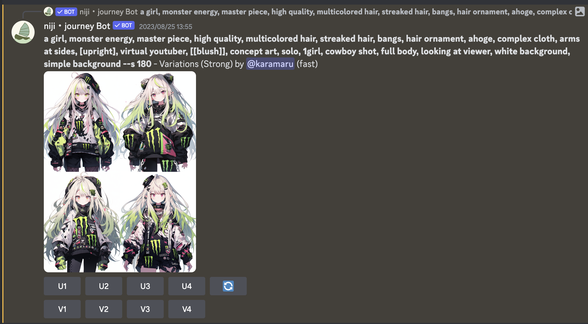

モンスターガール可愛いですね。

`a girl ... simple background`までがプロンプトパートになっていて、女の子(`a girl`)+モンスター(`monster energy`)を先頭におくことでモンスターガールを誕生させています。

後ろに続く長いプロンプトはキャラの立ち方や構図・背景などを指定するいわゆる"呪文"と言われる部分です。VTuberモデルなら直立で正面を向いており、背景もシンプルなものが好ましいでしょう。呪文系は結構まとめサイトが多いので各自チェックしてみてください。 cf.[【Stable Diffusion】 ポーズや構図に関するプロンプト（呪文一覧）](https://hikari-aiart.com/stablediffusion-pronpt-pose/)

また、にじジャーニーには**特定の絵に対して類似の絵を出力する機能**(上記`U1`~`U4`ボタン)や、**特定の絵を高画質に出力する機能**(上記`V1`~`V4`)があり、これらを駆使して画像生成していく形になります。

### 画像生成をいっぱいしてみる

他に、雪っぽい女の子・ビビッドな女の子を出力した例を以下に挙げます。

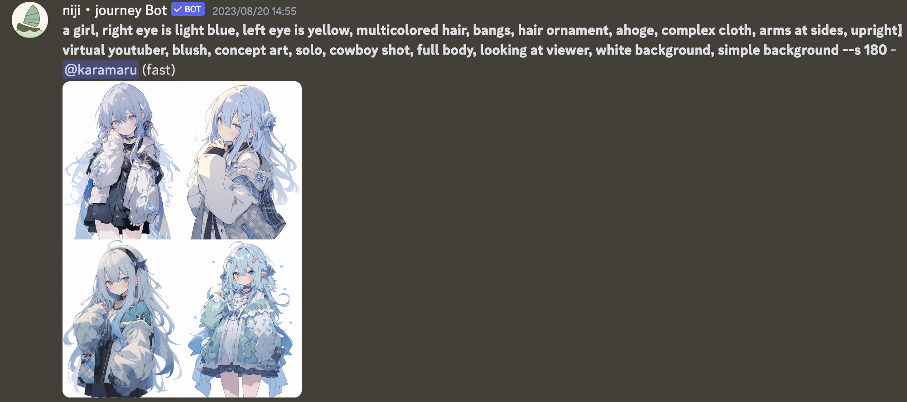
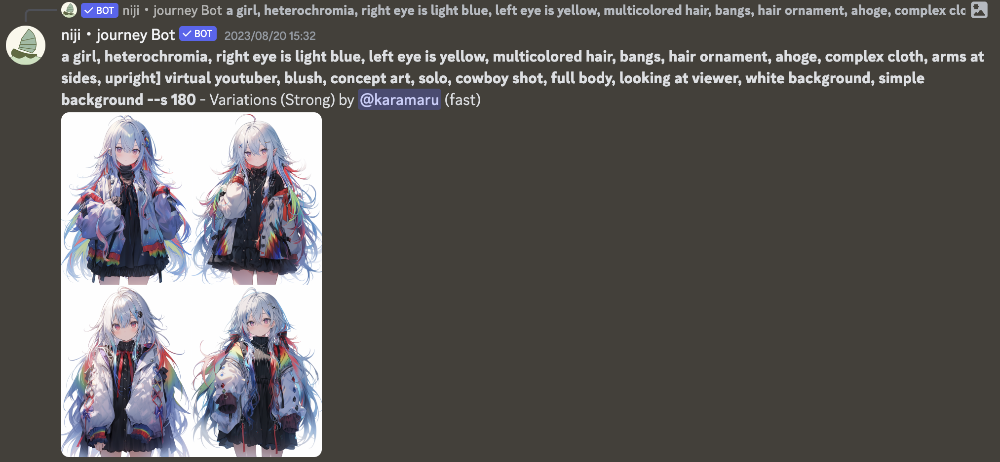

可愛い。

このようにプロンプトを変えるだけで絵柄が変わるのがとても便利である一方で、以外とプロンプト通りのキャラを顕現させるのって難しいんですよね。
英語でニュアンスも伝えづらいしな、、と思って日本語をいれてみたところ、、、

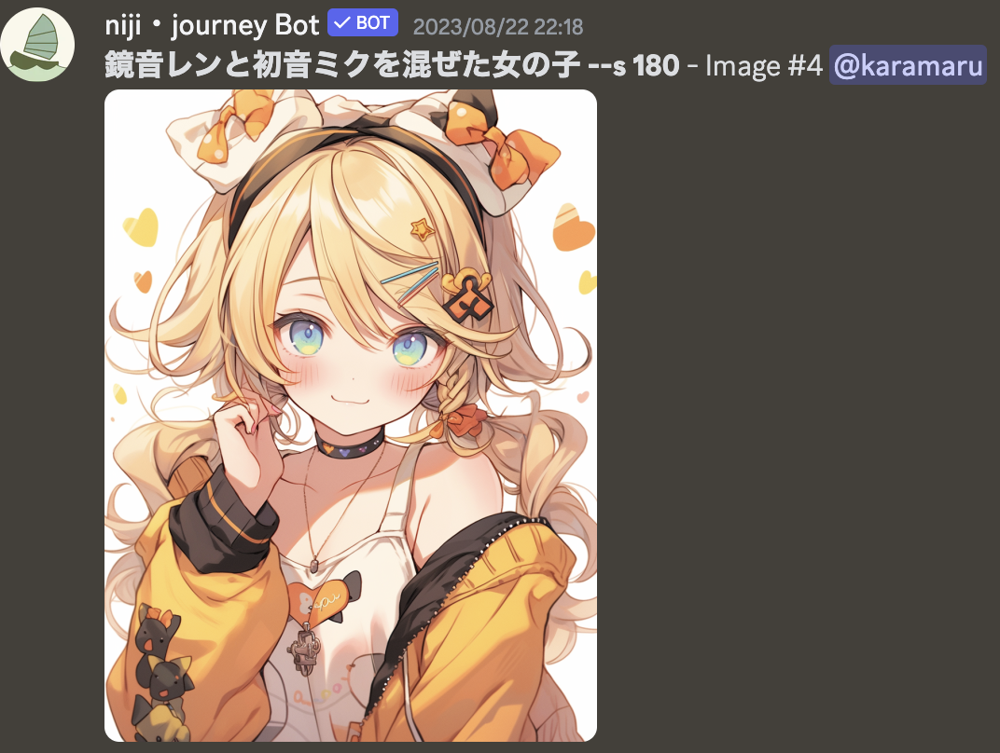

**いや全然日本語対応してる！！！笑**

なんか長々呪文を描いていた時間はなんだったんでしょう。構図も特に何も言わなくても普通にいいし。呪文おすすめサイトとか忘れてください。鏡音可愛い。

### VTuberモデルの原画を生成する

話を戻して、今回は**VTuberモデルの原画として"白髪で幼い男の子"を生成**します。
結論`可愛い男の子, 白い髪, 八重歯, アホ毛, 水色の瞳, 白背景, 直立, 上半身`というプロンプトで20回ぐらいガチャして、類似の絵を出力する機能も駆使し、以下の画像の生成に成功しました。

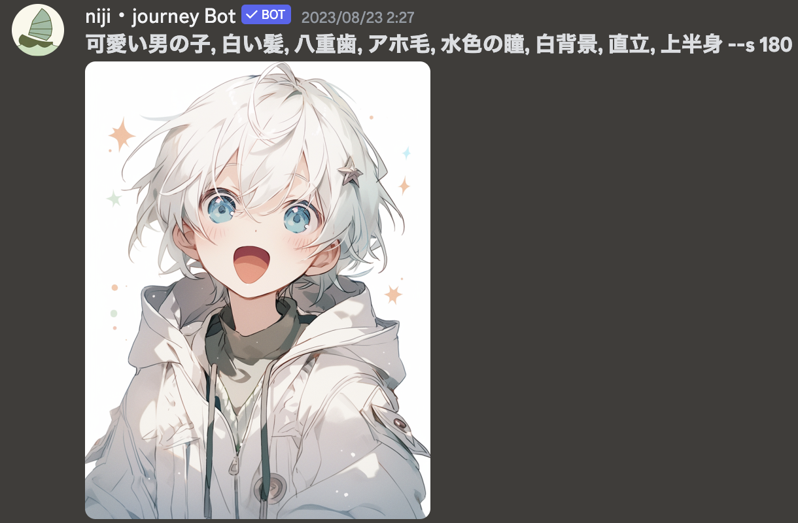

八重歯の設定は見事になくなっているけど、破綻のない絵柄でとても可愛いので今回はこの絵をベースにVTuberモデルを作成していくことにします💪

## 作業フェーズ - レイヤー分け・書き足し編

このフェーズは、上記生成AIを用いて出来た**原画に対して、Photoshopを用いてレイヤー分け・書き足しをする**工程になります。

Photoshopには10日程度の無料トライアル期間があるので、有料Adobe会員でない方はそちらを利用できるかと思います。

### レイヤー分け・書き足しが必要な理由

**なぜ原画にレイヤー分けが必要かというと、Live2Dモデリングした際のパーツごとの前後関係や揺れの独立を担保するため**です。
例えば髪の毛は、前髪や横髪は顔の輪郭の前に出ている一方で、後ろ髪は輪郭の後ろに配置する必要があるため、最低限"前髪"と"後ろ髪"はレイヤーが別れている必要があります。
もっと言うと、髪の毛の揺れは前髪中央の髪・横髪、アホ毛で別々に設定する必要があるので、"前髪"の中にも"前髪中央の髪"と"横髪"と"アホ毛"でレイヤーを分ける必要があるのです。

また、**キャラが動いた時にその後ろに本来あるべきものを書き足す作業が必要**になります。例えば、横髪が揺れて動いた時、本来であれば輪郭の肌や後ろ髪が見えるべきですが、原画の時点でそこは書かれていないため、別途レイヤーごとに書き足す必要があります。

レイヤー分けの仕方についてはLive2Dの公式チュートリアルがとてもわかりやすいので、そちらも参考にしてください。 

cf.[基本チュートリアル - イラストの加工](https://docs.live2d.com/cubism-editor-tutorials/psd/)

### 実際にレイヤー分け・書き足しを行う

絵を描いたことのない僕のような素人は、この作業が一番きついです。いくら原画があるとはいえ、パーツごとのレイヤー分け・動いた時に見えうる箇所の書き足し・AI由来の細かい絵の破綻の修正を行うのは結構大変で、12時間以上はかかりました。

以下は"髪の毛"部分を実際にレイヤー分け・書き足ししたものです。"前髪"・"左前髪"・"右前髪"・"アホ毛"・"後ろ髪"で5レイヤーに分けました。
レイヤー分けは以外と簡単で原画から消しゴムで消して分類していくだけなのですが、 **レイヤー分けした後の書き足し作業がとても大変**です。

後ろ髪の中央部分や前髪の重なる部分、どこまでを横前髪とするのかの区切る部分も全て書き足しで、見えない部分の目玉や口内も書き足す必要があります。

さらに、**余計な髪飾りを消したり**、髪の毛が被っていた部分を補完したりといった作業が必要になるので結構大変orz

詳細に見れば多少破綻している箇所もあるのでしょうが、今回は遠目からみて違和感なければokです。

今回は5パーツのみだったのでなんとかなった感はありますが、これ以上細かいとすごく時間がとれれそうだなと思いました。

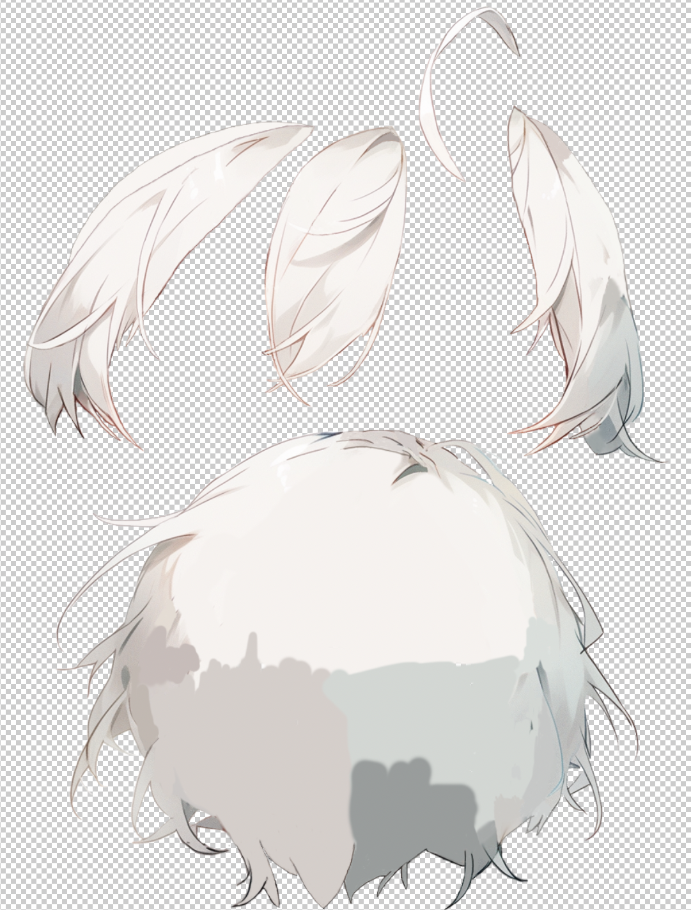

最終的に計20レイヤーを作成し、各種パーツ分け・書き足しを行いました。

- 髪
  - 前髪
  - 左右前髪
  - アホ毛
  - 後ろ髪
- 目
  - 左右目玉
  - 左右まつ毛
  - 左右白目
  - 左右眉毛
- 口
  - 上唇
  - 下唇
  - 口内
- 鼻
- 首
- 胴体

以下がそのレイヤー分けの一例です。
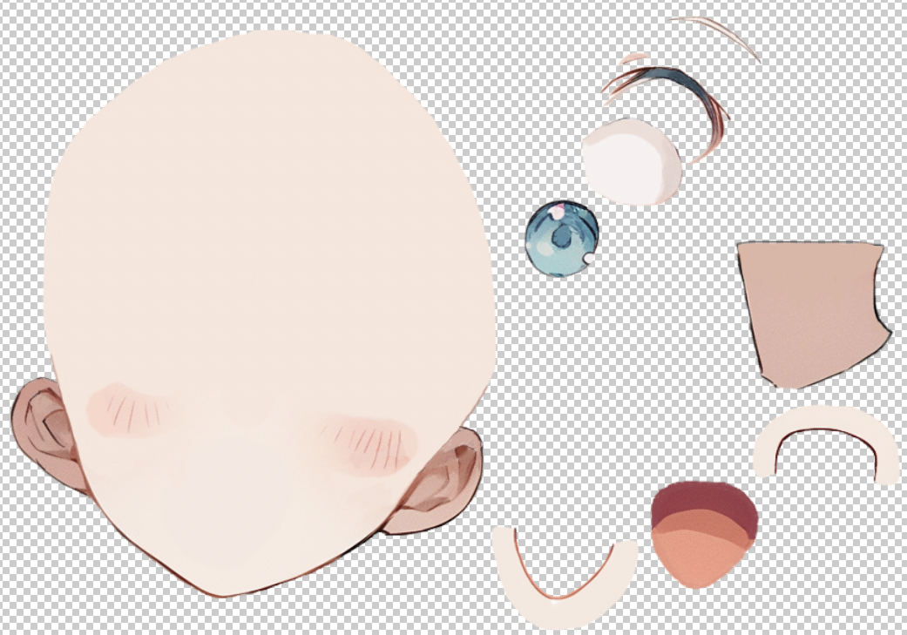

全てのレイヤー分け・書き足しを終えたらpsdファイルに保存し、いよいよ**Live2Dモデリング**に入ります🔥

## 作業フェーズ - Live2Dモデリング編

このフェーズは、上記レイヤー分け・書き足しを行った**psdファイルをLive2Dでモデリングし実際に動かせる状態にする**工程になります。

Live2Dは有料ソフトですが、40日程度の無料トライアル期間があるので、今回はそれを活用しました。

モデリングについては公式のチュートリアルが全てで、基本的に以下をやれば3時間程度で眉毛の上下・まばたき・口の開閉・顔の向き検知を行うことが出来ます。

- [基本チュートリアル - 表情の動き付け](https://docs.live2d.com/cubism-editor-tutorials/expression/)
- [基本チュートリアル - 体の動き付け](https://docs.live2d.com/cubism-editor-tutorials/deformer/)
- [基本チュートリアル - 顔のXYの動き付け](https://docs.live2d.com/cubism-editor-tutorials/xy/)

目玉が白目から、口内が唇からはみ出さないように要素を内包させる**クリッピング**や、動きに合わせて変形させる**デフォーマ**といった機能を学ぶことが出来ます。

画面としてはこんな感じです。例えば前髪なら、前髪レイヤー("髪 前")に対して、髪の毛が揺れた時の変形設定をしたデフォーマ("前髪の揺れ")が親として内包し、さらにそれを顔が傾いた時の変形設定をしたデフォーマ("前髪の曲面")で内包することで、前髪の揺れと顔の傾きに対応した動きを実現しています。

自分の子が動く姿は可愛いですね☺️

また発展として、物理演算を用いて髪の毛を慣性で揺らすことも可能です。可愛いのでやること推奨です！！🔥
- [組み込み用チュートリアル - 物理演算設定](https://docs.live2d.com/cubism-editor-tutorials/physical-calculation-settings/)

画面としてはこんな感じで、振り子の要素で慣性による髪の毛の揺れを表現しています。今回は後ろ髪・各種前髪・アホ毛に物理演算をそれぞれ設定しました。
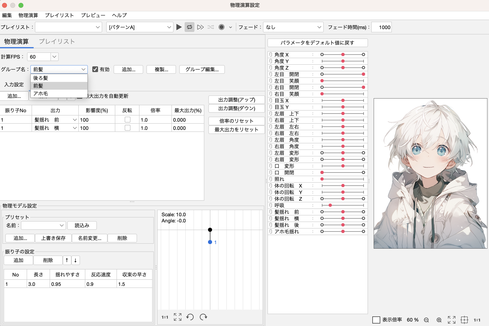

各動きに対応したLive2D上の設定が終わったら適宜書き出しを行い、いよいよ**配信設定**です👏

## 作業フェーズ - 配信編

### 顔の動きとモデルを同期させる

Live2Dモデルを動作させるサービスは色々あるみたいですが、Macでは[VTube Studio](https://store.steampowered.com/app/1325860/VTube_Studio/?l=japanese)がおすすめのようです。

VTube Studioがキャラクターを管理するディレクトリ配下に、先ほどLive2Dで出力したモデルデータ・物理演算データを配置することで以下のようにVTuberモデルを表示することが出来ます👏

次に、**設定->カメラからMacデフォルトのカメラを選択することで、ついに顔の動きとモデルの動きが同期されるように**なります！自動生成の絵に命が吹き込まれる瞬間、、、尊い👏

また、目を閉じる感度や口を開く感度などの微調整もここで設定出来ます。(あと背景も)

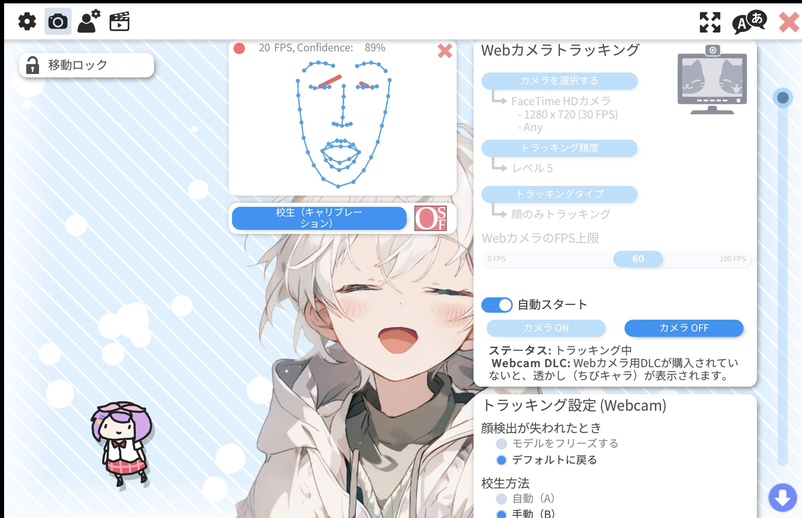

やったー！自分で生成したオリジナルキャラが、自分の顔の動きと同期して動いてる！！！商用利用という免罪符付きで！！！！！

正直ここまでやったらもう満足感はありますが、せっかくなので会議に出るところまでやってみます。

### Zoomやハドルで配信する

さて、このモデルをZoomやハドルで配信するにはどうすればいいのでしょうか。

VTube Studioには"バーチャルWebカメラ"という仮想カメラを建てる機能が備わっているのですが、この機能はMacOSには対応していないため非活性となっていますorz

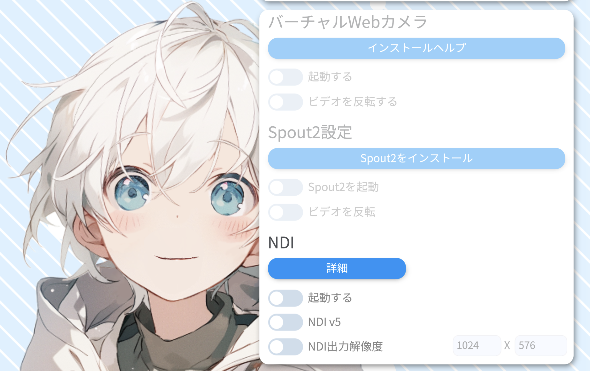

よって、**[OBS Studio](https://obsproject.com/ja)を用いてVTube Studioの画面をキャプチャし、OBS Studioの仮想カメラをZoomやハドルに表示する**ことで、アバターを配信することでMacでアバター配信を実現します。

画面はこんな感じ。VTubeStudio無料番だと左下で変な奴がうろちょろしているので配信にはうつさないように画角設定しましょう。

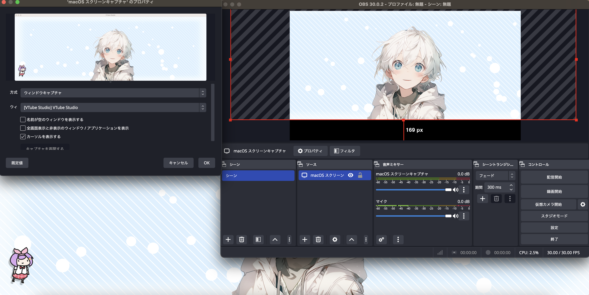

上記OBSの**"仮想カメラ起動"**を選択することで、Zoomやハドルのカメラ設定でOBSの画面を選択することができるようになります🔥

これであなたもバーチャル社会人の仲間入りです👏👏👏

Zoom
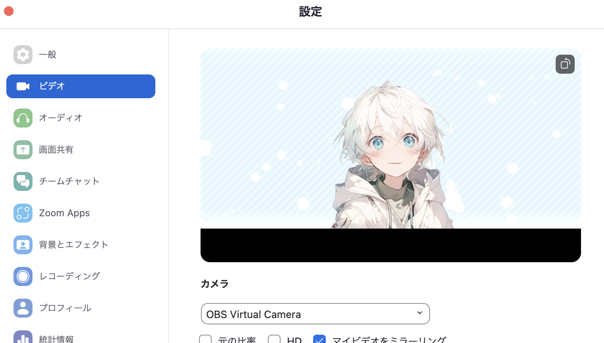

ハドル
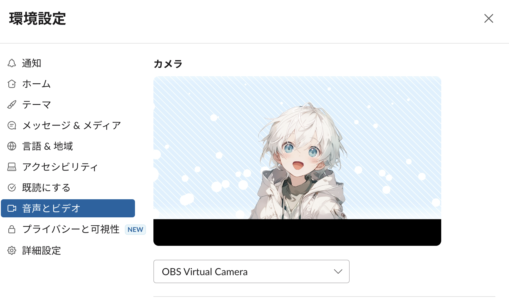

## 終わりに

いかがだったでしょうか？
工数自体は少なくはありませんが、絵が描けない人でも生成AIを用いることでアバターを作成し、Zoomやハドルで使用するまでの全ての工程をMacBookPro単体で行うことが出来ました。

今後Youtubeで配信するとかあれば推しになってください！

以上です。
