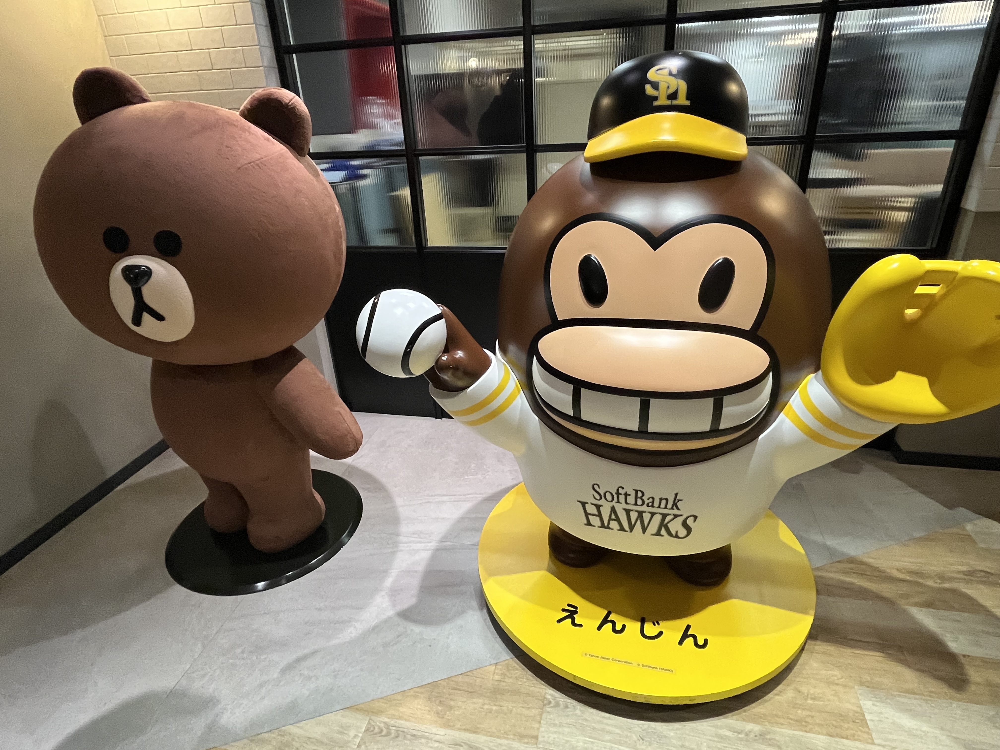
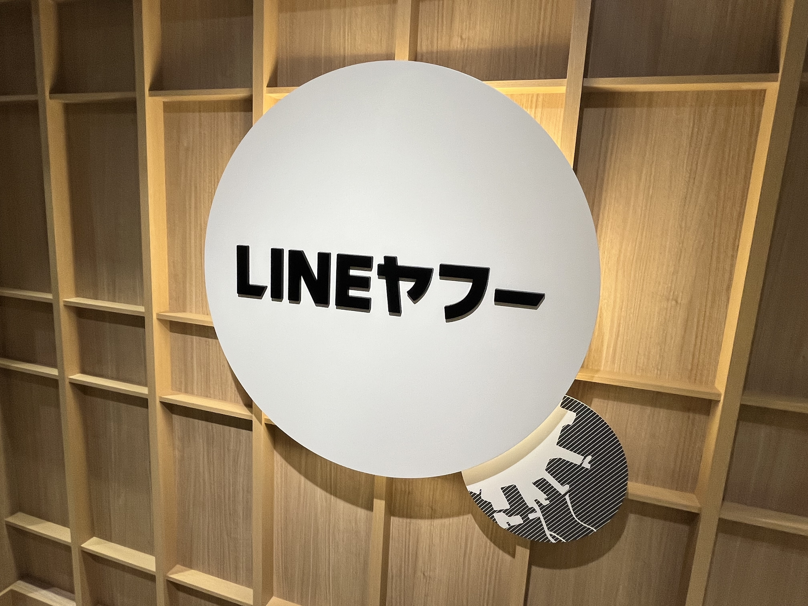
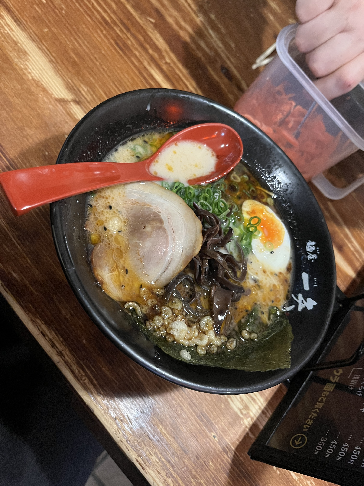

Gopher's Gathering（＠Lineヤフーさん）で登壇してきました。
protobufやcueを例に、自動生成の可能性について話しました。

<!--more-->

## 発表内容



- ProtocPluginを用いて定型化できるもの全てを生成しているよ（RPCはもちろん、SQL定義やDB操作I/Fとその実装、キャッシュ、CLI、環境変数、ランキング、デバッグコマンド、ログなど）
- gRPC採用出なくても自動生成はできる（GraphQLやyamlなど。本発表ではcue実装を取り上げた。）
- 何を自動生成するのか？何から自動生成するのか？を選ぶのはプロジェクトやメンバーの性格次第で選択するべき。そこに美学がある。

## 雑談

ここまで自動生成しててすごいって少しでも思ってもらえたら嬉しいなー！
RPC系を飛び越えて、DB周りや実ロジックを全てprotoで統一する思想はなかなか面白かったんじゃないでしょうか。
型安全且つシンタックスを1つに統一できるという点で、gRPCを採用している"弊プロジェクトでは"、protoファイルは自動生成元として優れた選択なんじゃないかなと思います。

自動生成自体をするのか、するとして自動生成対象やソースは何にするのか？などはプロジェクトごとに選択すべき事項だとは思いますが、実装/思想例の1つとして参考にしていただけたなら幸いです。

本当はGo1.24の機能について話そうとしてたんだけど納得できる資料が作れなくて、、、別の機会に調査時間とって発表したいです><

イベントではいろんな人と話せて楽しかったです！
過去登壇資料を見ていて気になっていた人に会えたり、逆に資料見てます！って言われたり（嬉しかった）、初対面の人と深夜までお酒を飲んだり、最高の福岡旅行でした。

運営者は学生さんらしいですですね、活動的ですごい、運営お疲れ様でした👏
総じていいイベントでした。

## 関連リンク

- https://speakerdeck.com/karamaru/zi-dong-sheng-cheng-nohua-wosiyou-protobuf-cue-1ci-sosunomei-xue
- https://connpass.com/event/329963/
