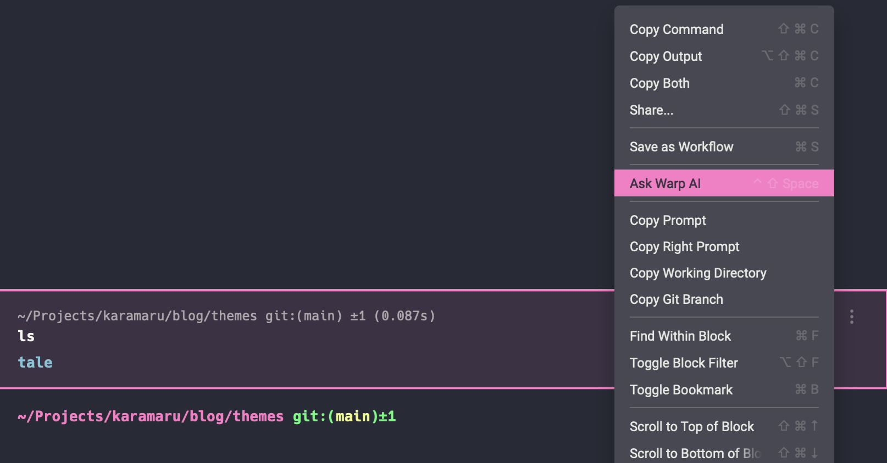
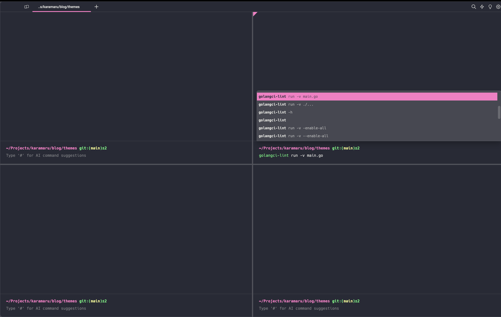
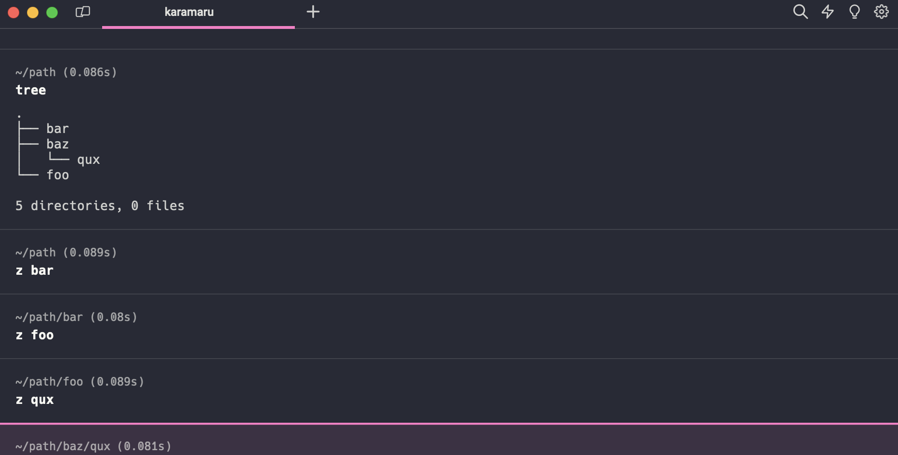
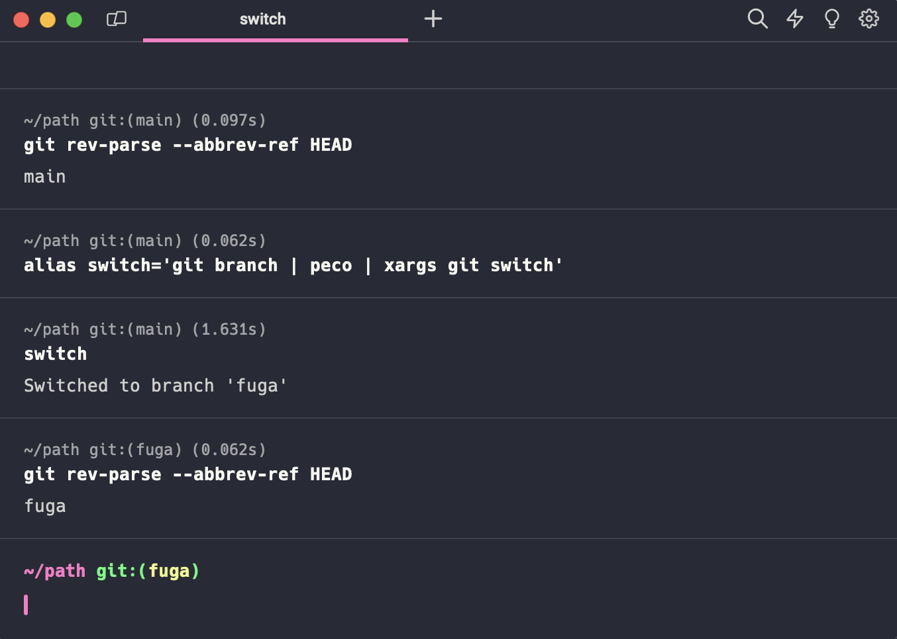
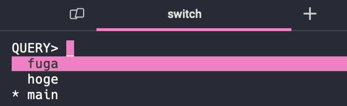

業務効率爆上がりな主観的おすすめターミナルツール3選を推す記事です🔥

友人とかに紹介しても知らないことが多かったので布教です。

<!--more-->

以下3つを紹介するだけなので、知ってる人はブラウザバックでokです。

- [warp](https://www.warp.dev/)
- [z](https://github.com/rupa/z)
- [peco](https://github.com/peco/peco)

# warp

https://www.warp.dev/

**神ターミナル**です。

自分はiTerm2ユーザーだったのですが、操作性・補完の部分で圧倒的にwarpの方が体感が良く、一瞬で虜になりました。

抜粋するとこんな特徴があります。

- 強い**コマンド補完**やリッチな**シンタックスハイライト**が標準装備
- コマンド補完やシンタックスハイライトが**SSH先のサーバーでも効く** (強すぎ)
- **画面分割**がコマンド(cmd+D)でサクサク縦横に区切れる
- **コマンドブロックごとに**選択・検索・コピーができる
- **AI**に出力を投げる機能もある

以下記事がより詳しいです。ぜひ見ていってください！

cf. [iTermをやめてWarpというモダンターミナルアプリを導入したら、生産性がやはり爆上がりした件](https://zenn.dev/lclco/articles/03cc961bfd64c1)

<参考画像> コードブロック選択・AIオプションがある.png

<参考画像> 補完強すぎ・分割がサクサク.png

# z

https://github.com/rupa/z

**部分一致でディレクトリ移動**できる、cdの完全上位互換ツールです。(神すぎ)

例えば以下のような感じで、階層を気にせず縦横無尽に移動することができます。
- `/path/to/foo`から`/path/to/bar`に移動したい場合、`z bar`で移動できる
- `/path/to/bar`から`/path/to/baz/qux`に移動したい場合、`z quz`(もっと言えば`z q`)で移動できる

内部的には直近移動(cd)したディレクトリを記憶し、部分一致で最近移動した場所へ連れていってくれるみたいです。

`cd ../hoge`なんて都度階層を気にして移動している場合ではないです！🥺

<参考画像> zでびゅんびゅん.png

# peco

https://github.com/peco/peco

**標準出力をインクリメンタルサーチ**(動的に検索)した後に、選択した**結果を出力**するツールです。

応用力が高く、例えば`alias switch='git branch | peco | xargs git switch'`とすれば**Gitブランチの動的なswitch**を実現できます。(意外と助かる)

<参考画像> 選択したブランチに移動できる.png

<参考画像> `switch`時移動したいブランチを選択してる画面.png

以上です。みんなのおすすめも教えてください！
